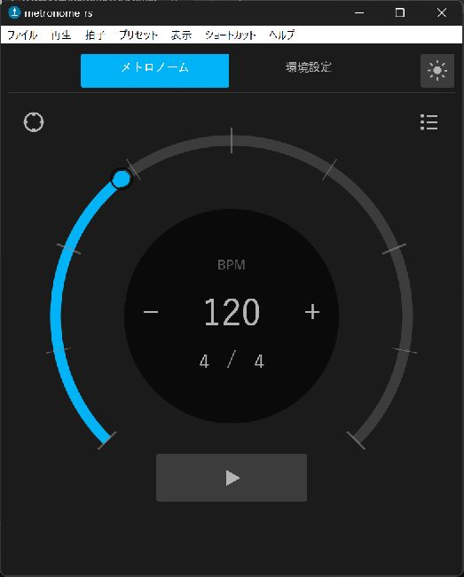

# metronome-rs

[日本語](#日本語) | [English](#english)



## 日本語

Rust / eguiで実装した、Windows・macOS・Linux向けのデスクトップメトロノームです。

### 主な機能

- 円弧／拍リングの2種類のメーター
- BPM 20〜1000、拍数と分母の直接入力
- BPMプリセット、カスタムクリック音、音量・発音タイミング補正
- ライト／ダークテーマ、アクセントカラー、アクセントアニメーション
- 通知領域でのバックグラウンド動作、PC起動時の自動起動
- カスタマイズ可能なアプリ内／グローバルショートカット
- 日本語／英語UI

### ダウンロード

[GitHub Releases](https://github.com/Aodaruma/metronome-rs/releases) から、お使いのOS向けアーカイブをダウンロードしてください。

### 開発

```sh
cargo run
cargo test --locked
cargo clippy --locked --all-targets --all-features -- -D warnings
```

Linuxでのビルドには、ALSA、GTK 3、libxdo、Ayatana AppIndicator、X11の開発パッケージが必要です。

### 開発支援

継続的な開発を支援いただける場合は、[GitHub Sponsors](https://github.com/sponsors/Aodaruma)をご利用ください。

### ライセンス

MIT Licenseです。依存ライブラリの通知は[THIRD_PARTY_NOTICES](THIRD_PARTY_NOTICES)を参照してください。

## English

metronome-rs is a desktop metronome for Windows, macOS, and Linux, built with Rust and egui.

### Features

- Arc and beat-ring meter modes
- Direct input for BPM 20–1000, beats, and beat unit
- BPM presets, custom click sounds, volume, and click timing offset
- Light and dark themes, custom accent color, and optional accent animation
- Background operation through the system tray and launch at startup
- Customizable in-app and global shortcuts
- Japanese and English interface

### Download

Download the archive for your operating system from [GitHub Releases](https://github.com/Aodaruma/metronome-rs/releases).

### Development

```sh
cargo run
cargo test --locked
cargo clippy --locked --all-targets --all-features -- -D warnings
```

Building on Linux requires the development packages for ALSA, GTK 3, libxdo, Ayatana AppIndicator, and X11.

### Sponsor

You can support ongoing development through [GitHub Sponsors](https://github.com/sponsors/Aodaruma).

### License

Licensed under the MIT License. See [THIRD_PARTY_NOTICES](THIRD_PARTY_NOTICES) for third-party dependency notices.
